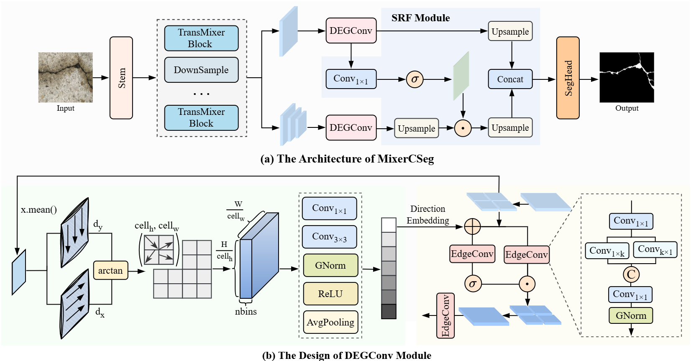

<div align="center">
<h1>[CVPR 2026] MixerCSeg </h1>
<h3>MixerCSeg: An Efficient Mixer Architecture for Crack Segmentation via Decoupled Mamba Attention</h3>

Zilong Zhao<sup>1</sup>,
Zhengming Ding<sup>2</sup>,
Pei Niu<sup>1</sup>, 
Wenhao Sun<sup>1</sup>, 
Feng Guo<sup>1</sup>, 

<sup>1</sup>  School of Qilu Transportation, Shandong University, China, <sup>2</sup>  Department of Computer Science, Tulane University,  USA.

<!-- Paper: ([arXiv 2401.10166](https://arxiv.org/abs/2401.10166)) -->

</div>


<!-- ## 
* [**updates**](#white_check_mark-updates)
* [**abstract**](#abstract)
* [**overview**](#overview--derivations)
* [**main results**](#main-results)
* [**getting started**](#getting-started)
* [**star history**](#star-history)
* [**citation**](#citation)
* [**acknowledgment**](#acknowledgment) -->


## 💥 News 💥
* **`Feb. 27th, 2026`**: We have released the code for MixerCSeg.
* **`Feb. 23th, 2026`**: **MixerCSeg has been accepted to CVPR 2026 !**


## Abstract

<p align="center">
    
</p>
Feature encoders play a key role in pixel-level crack segmentation by shaping the representation of fine textures and thin structures. Existing CNN-, Transformer-, and Mamba-based models each capture only part of the required spatial or structural information, leaving clear gaps in modeling complex crack patterns. To address this, we present MixerCSeg, a mixer architecture designed like a coordinated team of specialists, where CNN-like pathways focus on local textures, Transformer-style paths capture global dependencies, and Mamba-inspired flows model sequential context within a single encoder. At the core of MixerCSeg is the TransMixer, which explores Mamba’s latent attention behavior while establishing dedicated pathways that naturally express both locality and global awareness. To further enhance structural fidelity, we introduce a spatial block processing strategy and a Direction-guided Edge Gated Convolution (DEGConv) that strengthens edge sensitivity under irregular crack geometries with minimal computational overhead. A Spatial Refinement Multi-Level Fusion (SRF) module is then employed to refine multi-scale details without increasing complexity. Extensive experiments on multiple crack segmentation benchmarks show that MixerCSeg achieves state-of-the-art performance with only 2.05 GFLOPs and 2.54 M parameters, demonstrating both efficiency and strong representational capability.


## Installation
```
conda create -n MixerCSeg python=3.10 -y
conda activate MixerCSeg
pip install torch==2.1.0+cu118 torchvision==0.16.0+cu118 -f https://download.pytorch.org/whl/torch_stable.html
pip install numpy==1.23
pip install -U openmim
mim install mmcv-full
pip install mmsegmentation==0.30.0
pip install timm lmdb mmengine
```


###### 开发前的配置要求

1. xxxxx x.x.x
2. xxxxx x.x.x

###### **安装步骤**

1. Get a free API Key at [https://example.com](https://example.com)
2. Clone the repo

```sh
git clone https://github.com/shaojintian/Best_README_template.git
```

### 文件目录说明
eg:

```
filetree 
├── ARCHITECTURE.md
├── LICENSE.txt
├── README.md
├── /account/
├── /bbs/
├── /docs/
│  ├── /rules/
│  │  ├── backend.txt
│  │  └── frontend.txt
├── manage.py
├── /oa/
├── /static/
├── /templates/
├── useless.md
└── /util/

```


### 开发的架构 

请阅读[ARCHITECTURE.md](https://github.com/shaojintian/Best_README_template/blob/master/ARCHITECTURE.md) 查阅为该项目的架构。

### 部署

暂无

### 使用到的框架

- [xxxxxxx](https://getbootstrap.com)
- [xxxxxxx](https://jquery.com)
- [xxxxxxx](https://laravel.com)

### 贡献者

请阅读**CONTRIBUTING.md** 查阅为该项目做出贡献的开发者。

#### 如何参与开源项目

贡献使开源社区成为一个学习、激励和创造的绝佳场所。你所作的任何贡献都是**非常感谢**的。


1. Fork the Project
2. Create your Feature Branch (`git checkout -b feature/AmazingFeature`)
3. Commit your Changes (`git commit -m 'Add some AmazingFeature'`)
4. Push to the Branch (`git push origin feature/AmazingFeature`)
5. Open a Pull Request


### 版本控制

该项目使用Git进行版本管理。您可以在repository参看当前可用版本。

### 作者

xxx@xxxx

知乎:xxxx  &ensp; qq:xxxxxx    

 *您也可以在贡献者名单中参看所有参与该项目的开发者。*

### 版权说明

该项目签署了MIT 授权许可，详情请参阅 [LICENSE.txt](https://github.com/shaojintian/Best_README_template/blob/master/LICENSE.txt)

### 鸣谢


- [GitHub Emoji Cheat Sheet](https://www.webpagefx.com/tools/emoji-cheat-sheet)
- [Img Shields](https://shields.io)
- [Choose an Open Source License](https://choosealicense.com)
- [GitHub Pages](https://pages.github.com)
- [Animate.css](https://daneden.github.io/animate.css)
- [xxxxxxxxxxxxxx](https://connoratherton.com/loaders)

<!-- links -->
[your-project-path]:shaojintian/Best_README_template

[contributors-url]: https://github.com/shaojintian/Best_README_template/graphs/contributors
[forks-shield]: https://img.shields.io/github/forks/shaojintian/Best_README_template.svg?style=flat-square
[forks-url]: https://github.com/shaojintian/Best_README_template/network/members
[stars-shield]: https://img.shields.io/github/stars/shaojintian/Best_README_template.svg?style=flat-square
[stars-url]: https://github.com/shaojintian/Best_README_template/stargazers
[issues-shield]: https://img.shields.io/github/issues/shaojintian/Best_README_template.svg?style=flat-square
[issues-url]: https://img.shields.io/github/issues/shaojintian/Best_README_template.svg
[license-shield]: https://img.shields.io/github/license/shaojintian/Best_README_template.svg?style=flat-square
[license-url]: https://github.com/shaojintian/Best_README_template/blob/master/LICENSE.txt
[linkedin-shield]: https://img.shields.io/badge/-LinkedIn-black.svg?style=flat-square&logo=linkedin&colorB=555
[linkedin-url]: https://linkedin.com/in/shaojintian


